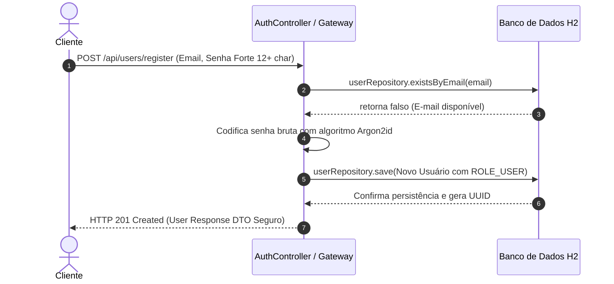
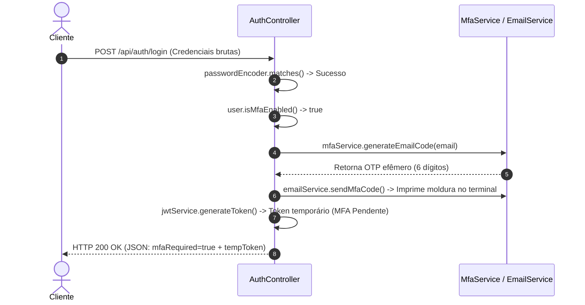
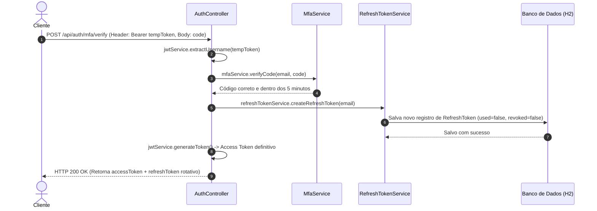

# **🛡️ SentinelAuth: Manual de Engenharia e Arquitetura de Software**

Bem-vindo ao documento oficial de especificação técnica do **SentinelAuth**. Este documento serve como guia de referência completo sobre o funcionamento, arquitetura de segurança, histórico de engenharia, ciclo de vida do software e usabilidade do ecossistema.

## **1\. Objetivo do Projeto**

O **SentinelAuth** é um ecossistema de autenticação e autorização de alta segurança (AppSec) desenvolvido em Java com Spring Boot. O seu objetivo principal é implementar um modelo de identidade robusto baseado no princípio de **Defesa em Profundidade (Defense-in-Depth)**.  
O projeto foca em proteger as credenciais e sessões dos utilizadores contra vetores de ataque modernos através de:

- Criptografia de senhas de última geração (**Argon2id**).
- Autenticação Multifatorial Out-of-Band (**MFA via Email OTP**).
- Prevenção contra roubo e sequestro de sessão através do padrão **RTR (Refresh Token Rotation)**.
- Defesa de perímetro contra força bruta e negação de serviço (**Rate Limiting com Bucket4j**).
- Privacidade e segurança de dados utilizando identificadores universais não previsíveis (**UUIDs**).

## **2\. Estrutura de Pastas e Organização do Código**

O projeto segue a estrutura padrão do Maven e as convenções de arquitetura em camadas do ecossistema Spring:

```text
src/main/java/com/sentinelauth/security/
│
├── SentinelAuthApplication.java (Ponto de Entrada e configuração global da JVM)
│
├── model/ (Entidades de Persistência)
│ ├── User.java (Entidade do Utilizador)
│ └── RefreshToken.java (Entidade de Rotação de Sessão \- RTR)
│
├── repository/ (Acesso ao Banco de Dados JpaRepository)
│ ├── UserRepository.java
│ └── RefreshTokenRepository.java
│
├── dto/ (Data Transfer Objects \- Proteção de Entrada/Saída)
│ ├── UserRegistrationDTO.java (Input de Registro com Políticas de Senha)
│ ├── UserResponseDTO.java (Output de Perfil Seguro)
│ ├── LoginRequestDTO.java (Input de Credenciais)
│ ├── LoginResponseDTO.java (Polimorfismo de Login: Sucesso vs MFA Pendente)
│ └── TokenDtos.java (Estruturas para rotação de sessão)
│
├── service/ (Lógica de Negócio de Domínio)
│ └── UserService.java (Registro e regras de negócio de utilizadores)
│
│
├── config/
│ ├── SecurityConfig.java (Filtros, Endpoints e Headers de Segurança)
│ └── JwtAuthenticationFilter.java (Filtro Stateful de Validação JWT)
│
├── services/
│ ├── JwtService.java (Geração e Parsing de Access Tokens)
│ ├── RefreshTokenService.java(Serviço RTR de ciclo de vida de sessão)
│ ├── MfaService.java (Gerenciador de Códigos OTP Efêmeros)
│ ├── EmailService.java (Disparador e Simulador de Códigos MFA)
│ ├── CustomUserDetailsService.java (Ponte entre Spring Security e H2)
│ └── RateLimitingService.java (Defesa de Perímetro Bucket4j por IP)
│
├── exceptions/
│ └── TokenRefreshException.java (Exceção customizada para erros de sessão)
│
└── controllers/
 ├── AuthController.java (Endpoints de Login, Verify, Toggle, Refresh)
 └── GlobalExceptionHandler.java (Escudo de Erros \- Fail-Safe)
```

## **3\. Função de Cada Classe e Componente**

### **3.1. Camada de Inicialização e Configuração**

- **SentinelAuthApplication.java**: Configura propriedades cruciais na JVM antes da aplicação subir para compatibilidade (Java Compatibility Mode), garante fuso horário padronizado em **UTC** (essencial para auditoria temporal e logs) e inicia o Spring.
- **SecurityConfig.java**: Configura o ecossistema do Spring Security. Desativa o CSRF (visto que a API é stateless baseada em JWT), define a política de criação de sessão como stateless, injeta os cabeçalhos HTTP rígidos de segurança (**HSTS, CSP, Referrer-Policy, FrameOptions contra Clickjacking**), declara a whitelist de rotas públicas e adiciona o filtro JWT à cadeia.

### **3.2. Camada de Segurança e Filtro**

- **JwtAuthenticationFilter.java**: Filtro executado a cada requisição. Extrai o token do cabeçalho Authorization: Bearer, valida sua assinatura através do JwtService, utiliza inicialização preguiçosa (@Lazy) do UserDetailsService para evitar referências circulares e autentica o usuário no contexto do Spring de forma segura.
- **CustomUserDetailsService.java**: Realiza a ponte de integração. Em vez de usar dados em memória, consulta o UserRepository para carregar as credenciais reais persistidas na base de dados H2.

### **3.3. Camada de Serviços de Segurança (Servlets e Utilitários)**

- **JwtService.java**: Centraliza a criptografia simétrica (HMAC-SHA256) dos tokens de acesso de curta duração (Access Tokens). Extrai claims e valida expirações de forma segura.
- **RefreshTokenService.java**: Implementa as regras rígidas do **Refresh Token Rotation (RTR)**. Controla a geração de novos tokens de atualização, verifica o estado do token apresentado (used, revoked), invalida sessões corrompidas e previne o avanço de transações em rollback por meio de controle de exceção customizada (noRollbackFor).
- **MfaService.java**: Gera códigos efêmeros de 6 dígitos baseados em criptografia segura (SecureRandom) associados ao email do usuário, com validade rígida de 5 minutos, armazenados em estrutura thread-safe (ConcurrentHashMap).
- **EmailService.java**: Simula a entrega dos códigos MFA ao usuário. Atualmente, usa impressão formatada de alta visibilidade no terminal do IntelliJ (System.out.println) para fins de debug local rápido.
- **RateLimitingService.java**: Defesa de perímetro baseada em rede. Utiliza o **Bucket4j** para monitorar a frequência de chamadas por endereço IP de origem, permitindo até 5 requisições por minuto com recarga gradual.

## **4\. Dependências e Acoplamento (Quem Depende de Quem)**

A arquitetura do **SentinelAuth** foi desenhada de forma a respeitar o fluxo unidirecional de dependências, evitando acoplamento excessivo e impedindo ciclos circulares de inicialização.

```text
               +----------------------+
               |   SecurityConfig     |
               +----------+-----------+
                          | (Injeta)
                          v
               +----------------------+
               | JwtAuthenticationFltr| <-------+
               +----------+-----------+         |
                          | (Consulta)          | (@Lazy resolve
                          v                     |  o ciclo aqui)
               +----------------------+         |
               |CustomUserDetailsService|       |
               +----------+-----------+         |
                          | (Lê)                |
                          v                     |
               +----------------------+         |
               |    UserRepository    | --------+
               +----------------------+
```

### **Detalhamento de Dependência do Fluxo de Login:**

1. **AuthController** depende de:
   - UserRepository (para verificar se o e-mail existe).
   - PasswordEncoder (para checar hash Argon2id da senha).
   - MfaService & EmailService (para gerar e notificar o OTP).
   - JwtService (para emitir o token temporário ou definitivo).
   - RefreshTokenService (para gerar e rotacionar a sessão).
2. **JwtAuthenticationFilter** depende de:
   - JwtService (para ler e traduzir o token recebido no header).
   - UserDetailsService (injetado via @Lazy para carregar o usuário e confrontá-lo com o token).

## **5\. Histórico de Desafios e Resolução de Erros (Debugging History)**

Durante o desenvolvimento do projeto, nos deparamos com problemas técnicos complexos que foram analisados e corrigidos com soluções limpas de engenharia:

### **🔴 Desafio 1: Erro 500 ao ativar o MFA (/mfa/toggle)**

- **Sintoma:** Ao tentar chamar a rota de alternar MFA, o servidor retornava erro 500 instantâneo.
- **Causa:** A tabela no banco de dados H2 não havia sido atualizada com o campo mfa_enabled porque o banco subiu antes da entidade ser modificada, ou o token temporário do MFA foi passado na rota errada, gerando um erro de casting no filtro de segurança.
- **Resolução:** Adição de propriedades automáticas de atualização de DDL (spring.jpa.hibernate.ddl-auto=update), blindagem do JwtAuthenticationFilter para ignorar a string literal do Postman {{sentinel\_jwt}} e validação do tipo de autenticação nas rotas do Postman (configuração de rotas de autenticação estrita).

### **🔴 Desafio 2: Referência Circular na Inicialização do Spring Boot**

- **Sintoma:** O Spring Boot impedia a inicialização e abortava o sistema na inicialização dos beans.
- **Causa:** SecurityConfig precisava do JwtAuthenticationFilter, que precisava do UserDetailsService, que por sua vez estava sendo exposto pelo SecurityConfig. Um ciclo clássico fechado.
- **Resolução:** Uso da anotação **@Lazy** no construtor do JwtAuthenticationFilter para injetar o proxy do UserDetailsService em tempo de execução, permitindo que a aplicação inicialize sem problemas de precedência.

### **🔴 Desafio 3: UsernameNotFoundException e Erros 403 Generalizados**

- **Sintoma:** Qualquer requisição protegida falhava com 403, e requisições públicas davam erro 500 após o primeiro login.
- **Causa:** O Spring Security estava utilizando por padrão a implementação InMemoryUserDetailsManager do usuário, incapaz de ler os registros do H2. Além disso, o filtro JWT lançava exceções brutas ao tentar interpretar variáveis não resolvidas do Postman, travando o pipeline do Spring.
- **Resolução:** Criação do CustomUserDetailsService integrado ao banco de dados e blindagem com blocos de captura de erros internos específicos (try-catch) dentro do doFilterInternal do filtro.

### **🔴 Desafio 4: Bypass de Reutilização de Refresh Token Antigo**

- **Sintoma:** Mesmo após a detecção de um ataque de reutilização de token antigo, reenviar a requisição funcionava com sucesso.
- **Causa:** A anotação @Transactional padrão do Spring desfazia o salvamento de invalidação dos tokens caso uma exceção de segurança fosse disparada no mesmo método (Rollback transacional).
- **Resolução:** Adição da regra noRollbackFor \= SecurityException.class na transação do serviço de refresh e persistência imediata com .saveAndFlush(oldToken).

## **6\. O Ciclo de Vida do Código (How It Works)**

Abaixo está o mapeamento de fluxo de ponta a ponta de como o cliente final interage com a API em um fluxo de alta segurança.

### **6.1. Fluxo de Registro de Conta (Nova Identidade)**



### **6.2. Fluxo de Login em Dois Passos (MFA Habilitado)**



### **6.3. Fluxo de Verificação (MFA Verify)**



## **7\. Próximos Passos de Implementação (Roadmap)**

### **7.1. Integração com um Frontend Moderno (React)**

Pretendo desenvolver um frontend em React para consumir a API do SentinelAuth, proporcionando uma experiência de usuário fluida e moderna. O frontend incluirá:
- Formulário de registro com validação de senha em tempo real.
- Fluxo de login com feedback visual para MFA pendente.
- Dashboard de perfil do usuário com opção de ativar/desativar MFA.
- Gerenciamento de sessão com renovação silenciosa de tokens e logout seguro.

### **7.2. Integração SMTP Real (Mailtrap para Testes)**

Substituir o atual EmailService em console por uma conexão de envio real para caixas de entrada utilizando SMTP com o Mailtrap (ambiente seguro e gratuito para desenvolvimento):

- **application.properties**:
  spring.mail.host=sandbox.smtp.mailtrap.io
  spring.mail.port=2525
  spring.mail.username=seu_usuario_mailtrap
  spring.mail.password=sua_senha_mailtrap
  spring.mail.properties.mail.smtp.auth=true
  spring.mail.properties.mail.smtp.starttls.enable=true

- **Implementação real**:
  Injetar JavaMailSender no EmailService para formatar e disparar e-mails HTML elegantes contendo o código de desafio de segundo fator.

### **7.3. Banco de Dados Distribuído e Redis para Rate Limiting**

À medida que a aplicação crescer para múltiplos contêineres:

- Substituir o ConcurrentHashMap do RateLimitingService por um **conector Redis**, permitindo que o limite de tentativas por IP de origem seja mantido de forma consistente em escala distribuída.

### **7.4. Auditoria de Segurança Completa (Audit Trail)**

- Criação de uma entidade AuditEvent.java para persistir em banco de dados histórico de eventos relevantes de segurança:
  - _Eventos:_ LOGIN_SUCCESS, LOGIN_FAILED, MFA_FAILED, TOKEN_ROTATION, REUSE_DETECTION.
  - _Metadados coletados:_ IP de origem, data/hora em UTC, ID do usuário afetado e agente de requisição (browser/dispositivo).

## **8\. Definições de pom.xml (Primitivas e Bibliotecas de Apoio)**

- **Spring Boot Starter Web**: Para construção de APIs RESTful."
- **Spring Boot Starter Security**: Para integração do Spring Security e configuração de autenticação/autorizações.
- **Spring Boot Starter Data JPA**: Para abstração de acesso a dados e integração com o banco H2.
- **H2 Database**: Banco de dados em memória para desenvolvimento e testes rápidos.
- **Argon2id**: Biblioteca de hashing de senhas de última geração para proteção
- **jjwt (Java JWT)**: Para geração e validação de tokens JWT de forma segura.
- **Bucket4j**: Biblioteca de rate limiting para defesa de perímetro contra ataques de força bruta e negação de serviço.
- **Spring Boot Starter Mail**: Para integração com serviços de email SMTP (futuro envio real de códigos MFA).

## **9\. Como o Cliente Utiliza o Sistema (Guia do Consumidor da API)**

### **Passo 1: O Cliente se Registra**

- Envia um POST para /api/users/register contendo e-mail e uma senha forte (mínimo de 12 caracteres, com número, maiúscula e caractere especial).
- _Resposta:_ Retorna os dados cadastrados e o UUID de identificação gerado.

### **Passo 2: O Cliente Ativa o Segundo Fator (MFA)**

- Faz o login inicial sem MFA.
- Envia uma requisição POST para /api/auth/mfa/toggle enviando o token definitivo recebido.
- _Resposta:_ O servidor retorna "MFA ativado com sucesso".

### **Passo 3: O Fluxo Seguro do Dia a Dia (Login em Dois Passos)**

1. **Chama o Login:** O cliente faz um POST em /api/auth/login. O servidor identifica o MFA habilitado, gera o código de 6 dígitos no console (que no futuro será enviado para o e-mail real) e devolve o tempToken.
2. **Envia a Verificação:** O cliente coleta o código de 6 dígitos e faz um POST em /api/auth/mfa/verify. Passa o tempToken no header Authorization e o JSON { "code": "..." } no corpo.
3. **Sucesso:** O sistema valida o código e entrega o accessToken e o refreshToken.
4. **Renovação Silenciosa:** Quando o accessToken expira após 15 minutos, o cliente chama silenciosamente POST /api/auth/refresh enviando o seu refreshToken no corpo para obter novos tokens e continuar navegando de forma transparente.
